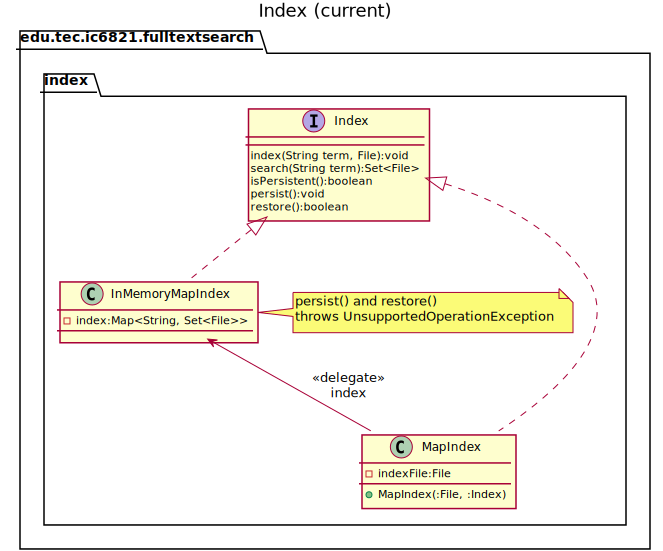
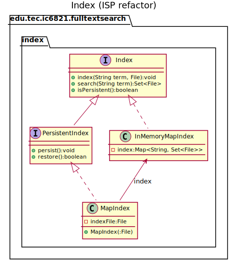
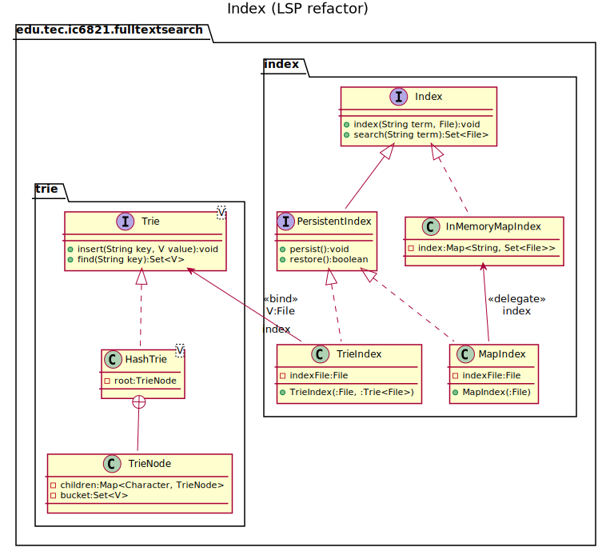

# Tarea corta #4 #

Curso IC-6821 Diseño de software  
Profesor Diego Munguía Molina

## Objetivos ##

* Observar la aplicación del principio de responsabilidad única en un ejercicio práctico.
* Aplicar el principio de segregación de interfaces en un ejercicio práctico
* Aplicar el principio de substitución de Liskov en un ejercicio práctico 

## Guía de trabajo ##

A través de las próximas tres tareas cortas vamos a implementar la aplicación de búsqueda en archivos de texto 
especificada en [STORIES.md](./STORIES.md).

Para diseñar los requerimientos solicitados iniciamos identificando las siguientes responsabilidades:

1. Indexar un directorio  
    a. Recorrer la fuente de datos (directorio) archivo por archivo  
    b. Procesar archivo de texto recorriendo su contenido palabra por palabra  
    c. Asociar una palabra con la ruta absoluta al archivo en el índice  
    d. Reportar en pantalla cuál directorio está siendo procesado  
2. Buscar archivos por términos  
    a. Buscar archivos en el índice por un término específico  
    b. Consolidar resultados para cada término en un conjunto final  
    c. Reportar resultados en pantalla  

Para esta tarea corta nos vamos a concentrar en las responsabilidades 1.c y 2.a. . Para resolver estas 
responsabilidades vamos a diseñar un módulo `index` que abstrae las funcionalidades del índice y un submódulo `trie`
que será utilizado por `index`.

Con este fin vamos a trabajar las siguientes tareas específicas.

### Tarea 1 ###

Iniciamos la implementación de nuestro módulo `index` con el siguiente diseño:

Partiendo de la especificación del contrato para `Index` se han desarrollado dos implementaciones, ambas basadas en una
estructura de datos `Map`: `InMemoryMapIndex`, `MapIndex`. 

Los datos de `InMemoryMapIndex` sólo se almacenan en memoria, cuando se destruye la instancia se pierden sus datos. Por 
otro lado, los datos de `MapIndex` se pueden guardar (persistir) en un archivo con la operación `persist`. Después de 
destruida la instancia, podremos restaurar dichos datos en una nueva instancia de `MapIndex` llamando a `restore`.

`MapIndex` utiliza a `InMemoryMapIndex` como delegado (implementando el patrón *Delegate*).

El diseño tiene un problema. Tanto `InMemoryMapIndex` como `MapIndex` implementan la misma interfaz `Index`. Esta
interfaz define operaciones `persist` y `restore` relacionadas con la persistencia de los datos del índice. Estas 
operaciones no tienen sentido para `InMemoryMapIndex`, pues está diseñada para ser volátil. Cuando se ejecuta `persist`
o `restore` en `InMemoryMapIndex` se lanza la excepción `UnsupportedOperationException`. Por lo tanto, la clase 
`InMemoryMapIndex` solo cumple parcialmente con el contrato especificado en `Index`.

Para evitar invocar a los métodos no soportados por equivocación, se provee además un predicado `isPersistent` que 
cuando es verdadero indica que los métodos son soportados, y cuando es falso no lo son. Esta es una solución débil, pues
transfiere a la persona programadora la responsabilidad de verificar si las operaciones son soportadas por la instancia
antes de tratar de ejecutarlas. Si las operaciones están definidas como parte del contrato en la interfaz entonces 
deberíamos poder asumir con seguridad que son soportadas.

Por estas razones, el diseño actual incumple con el principio de segregación de interfaces.

Antes de continuar con la propuesta de solución, pregúntese ¿cómo solucionaría usted este problema manteniendo ambas
implementaciones `MapIndex` e `InMemoryMapIndex`?

La propuesta de solución es sacar de `Index` la funcionalidad relacionada con persistencia hacia una nueva interfaz
`PersistentIndex`. De esta forma extendemos el contrato básico del índice con funciones de persistencia. Luego la clase
`InMemoryMapIndex` implementa el contrato del índice básico, mientras que `MapIndex` implementa el del índice extendido. 
De esta forma, cada clase cumple a cabalidad con su respectivo contrato, no sobra ni falta nada.

Refactorice el código actual en el repositorio para que cumpla con esta propuesta, y por lo tanto con el principio de
segregación de interfaces. 

### Tarea 2 ###

En atención a las recomendaciones realizadas en la especificación de requerimientos, queremos implementar el índice
utilizando una estructura de datos Trie.

La abstracción del comportamiento de los objetos en forma de interfaces permite desacoplar los contratos de sus 
implementaciones. Este desacoplamiento nos permite cumplir con el principio de sustitución de Liskov. 

Por ejemplo, en cualquier aplicación en la que estemos utilizando `Index`, podemos reemplazar la implementación basada 
en `Map` por una nueva implementación basada en `Trie` sin que haya que modificar más código que la línea donde se 
construye la instancia del objeto. Esto siempre y cuando todas las interacciones con el objeto se realicen siempre a 
través de su correspondiente interfaz.

Para seguir cumpliendo con el principio de sustitución de Liskov introducimos nuestra implementación de índice basado
en Trie a través de la interfaz `PersistentIndex` según se muestra en el siguiente diseño.

Para implementar este diseño necesitamos realizar las siguientes tareas:

- Implementar el módulo `trie` (`Trie`, `HashTrie`, `TrieNode`). En [DESIGN.md](DESIGN.md) podemos encontrar diagramas
  de actividad para los algoritmos `find` e `insert` para `HashTrie`.
  
- Implementar la clase `TrieIndex` en el módulo `index`. 

## Aspectos operativos ##

- No modificar ningún archivo de código ya existente en el repositorio (excepto por `CountingBoard`).
- No modificar ninguna prueba automatizada.
- No modificar ningún chequeo de estilo. 
- No utilizar spanglish.
- Escribir código limpio.
- Las pruebas de código verifican todos los requerimientos funcionales.
- Como entrega se considera el último `push` de código al repositorio antes de la revisión del trabajo.
- Puede encontrar información sobre cómo corregir problemas identificados por los chequeos de estilo en el siguiente 
  enlace: https://checkstyle.sourceforge.io/checks.html 

## Rúbrica ##

#### Total 10 pts #### 

#### Entrega (2 pts) ####
- (2 pts) El historial del repositorio contiene commits significativos de la persona estudiante.
- (0 pts) El historial del repositorio no contiene commits significativos de la persona estudiante. Si no hay commits 
  significativos, el resto de criterios no serán aplicados.

#### Chequeo de estilo (2 pts) ####
- (2 pts) El código en el repositorio pasa todos los chequeos de estilo.
- (0 pts) El código en el repositorio no pasa todos los chequeos de estilo.

#### Chequeo de diseño (3 pts) ####
- (3 pts) El código en el repositorio pasa todos los chequeos de diseño.
- (1 pts) El código en el repositorio pasa la mayoría de los chequeos de diseño.
- (0 pts) El código en el repositorio no pasa los chequeos de diseño.

#### Pruebas de código (3 pts)
- (3 pts) El código en el repositorio pasa todas las pruebas de código.
- (1 pts) El código en el repositorio pasa la mayoría de las pruebas de código.
- (0 pts) El código en el repositorio no pasa las pruebas de código.

